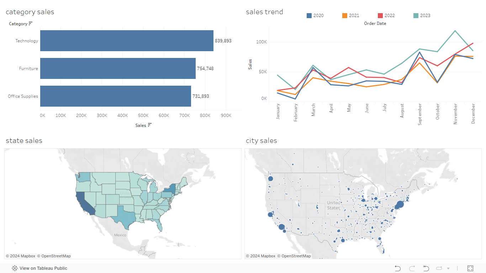

# US-Superstore-Dashboard-and-Story-Board

## Project title

US Sample Superstore Sales Dashboard and Story Board

## Description
A comprehensive Tableau project visualizing the US Superstore sales data. The project includes an interactive dashboard and a detailed story that provide insights into sales trends, product performance, and regional analysis.

## Data Sources
The Superstore dataset used in this dashboard is publicly available and can be downloaded from the Tableau website. The dataset contains data on sales, profits, and other metrics for a fictional company that sells office supplie.

- ### [US Sample Super Store Dataset](Sample%20-%20Superstore.xls)
- Source: "Sample - Superstore Data" from Tableau.

- Contents: Sales information of a fictional office supplies retailer.

- Key Columns: Order ID, Order Date, Ship Date, Ship Mode, Customer ID, Customer Name, Segment, Country, City, State, Postal Code, Region, Product ID, Category, Sub-Category, Product Name, Sales, Quantity, Discount, Profit.

## Visualization & Project Objectives
## Sales DashBoard:
- ### Objectives:
  - Category Sales
    To identify which product categories contribute most to the total sales and to monitor the performance of each category over time.
  - Sales Trend
    Identify seasonal patterns, trends, and anomalies in sales performance. This helps in understanding the growth trajectory and planning for future sales strategies.
  - State Sales
    To identify high-performing and underperforming states. This helps in targeting specific regions for marketing campaigns and resource allocation.
  - City Sales
    To pinpoint cities that are driving sales and those that need attention. This detailed analysis helps in making city-specific business decisions.

- ### [Sales Dashboard](Dashboard%20of%20sales.twbx)
- ### [Link to Tableau Public Visualization](https://public.tableau.com/app/profile/podaralla.harshitha/viz/Dashboardofsales_16971321435180/Dashboard1)
- ### Dashboard

## Sales Storyboard:

- ### Objectives:

- ### [Sales Storyboard](

